# Flujogramas operativos — Call Management

Documento de referencia visual de **cómo opera la plataforma multi-empresa** y **cómo los agentes de voz atienden** las interacciones (teléfono, playground y chat).

**Audiencia:** operación, producto, soporte y desarrollo.  
**Estado del sistema:** multi-tenant + plantillas + instancias por empresa + LiveKit SIP + xAI Grok Voice. La página admin **Flujos / Operación** (`/operations`) documenta plantillas; no es un trazador de llamadas en vivo.

---

## Índice de flujos

| # | Flujo | Qué responde |
|---|--------|----------------|
| 1 | [Mapa general del negocio](#1-mapa-general-del-negocio) | Qué es la plataforma y sus piezas |
| 2 | [Estructura multi-empresa](#2-estructura-multi-empresa) | Tenant → agentes → CRM → límites |
| 3 | [Canales de entrada](#3-canales-de-entrada) | Cómo llega una conversación |
| 4 | [Llamada telefónica PSTN (completa)](#4-llamada-telefónica-pstn-completa) | Del celular al agente |
| 5 | [Resolución DID → agente](#5-resolución-did--agente) | Qué número tocó y quién atiende |
| 6 | [Cola y límites de concurrencia](#6-cola-y-límites-de-concurrencia) | 3 capas de cupo |
| 7 | [Horario y estado del agente](#7-horario-y-estado-del-agente) | Fuera de horario / pausado |
| 8 | [Atención de la llamada (diálogo)](#8-atención-de-la-llamada-diálogo) | Escucha → tools → respuesta |
| 9 | [Recepción y handoffs](#9-recepción-y-handoffs) | Routing entre especialistas |
| 10 | [Soporte bancario (BAC)](#10-soporte-bancario-bac) | Flujo en español con tools |
| 11 | [Herramientas (CRM, SIP, xAI)](#11-herramientas-crm-sip-xai) | Qué puede hacer el agente |
| 12 | [Fin de llamada y post-proceso](#12-fin-de-llamada-y-post-proceso) | Resumen, CRM, webhooks, grabación |
| 13 | [Playground voz xAI (admin)](#13-playground-voz-xai-admin) | Prueba sin LiveKit room |
| 14 | [Playground LiveKit producción](#14-playground-livekit-producción) | Misma pipeline que PSTN |
| 15 | [Chat de texto multi-agente](#15-chat-de-texto-multi-agente) | Texto en admin |
| 16 | [Alta de empresa y agente](#16-alta-de-empresa-y-agente) | Setup operativo |
| 17 | [Roles y permisos (admin)](#17-roles-y-permisos-admin) | Quién ve qué (incluye `/operations`) |
| 18 | [Servicios en el VPS](#18-servicios-en-el-vps) | Admin + worker + nginx |

---

## 1. Mapa general del negocio

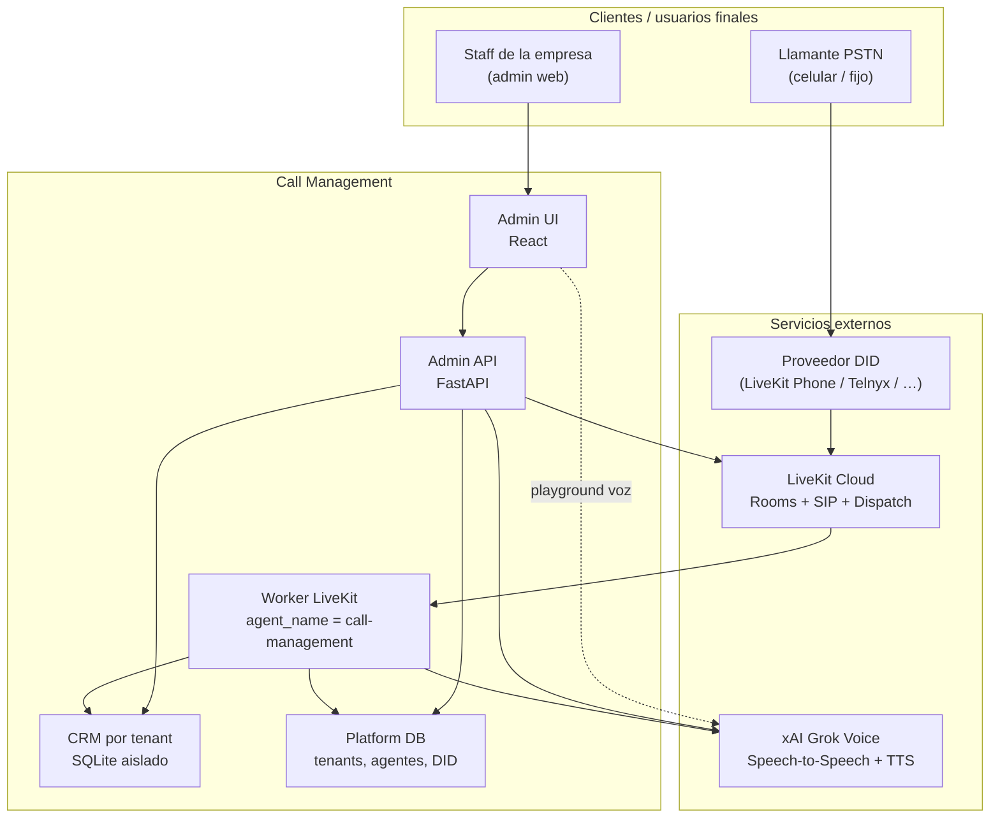
```mermaid
flowchart TB
  subgraph Clientes["Clientes / usuarios finales"]
    CALLER["Llamante PSTN<br/>(celular / fijo)"]
    STAFF["Staff de la empresa<br/>(admin web)"]
  end

  subgraph Plataforma["Call Management"]
    UI["Admin UI<br/>React"]
    API["Admin API<br/>FastAPI"]
    WORKER["Worker LiveKit<br/>agent_name = call-management"]
    CRM["CRM por tenant<br/>SQLite aislado"]
    PLATFORM["Platform DB<br/>tenants, agentes, DID"]
  end

  subgraph Externos["Servicios externos"]
    LK["LiveKit Cloud<br/>Rooms + SIP + Dispatch"]
    XAI["xAI Grok Voice<br/>Speech-to-Speech + TTS"]
    SIP["Proveedor DID<br/>(LiveKit Phone / Telnyx / …)"]
  end

  CALLER --> SIP --> LK
  LK --> WORKER
  WORKER --> XAI
  WORKER --> CRM
  WORKER --> PLATFORM

  STAFF --> UI --> API
  API --> CRM
  API --> PLATFORM
  API --> XAI
  API --> LK
  UI -.->|playground voz| XAI
```

**En una frase:** cada **empresa (tenant)** configura **agentes** y **números**; las llamadas entran por **LiveKit**; el **worker** corre la sesión de voz con **Grok**; el **admin** gestiona CRM, reportes y pruebas.

---

## 2. Estructura multi-empresa

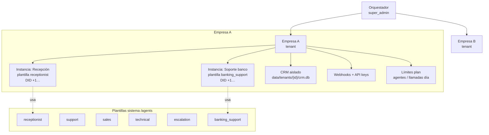
```mermaid
flowchart TB
  ORCH["Orquestador<br/>super_admin"]

  ORCH --> T1["Empresa A<br/>tenant"]
  ORCH --> T2["Empresa B<br/>tenant"]

  subgraph EmpresaA["Empresa A"]
    T1 --> A1["Instancia: Recepción<br/>plantilla receptionist<br/>DID +1…"]
    T1 --> A2["Instancia: Soporte banco<br/>plantilla banking_support<br/>DID +1…"]
    T1 --> CRM1["CRM aislado<br/>data/tenants/{id}/crm.db"]
    T1 --> WH1["Webhooks + API keys"]
    T1 --> LIM1["Límites plan<br/>agentes / llamadas día"]
  end

  subgraph Plantillas["Plantillas sistema /agents"]
    P1["receptionist"]
    P2["support"]
    P3["sales"]
    P4["technical"]
    P5["escalation"]
    P6["banking_support"]
  end

  A1 -.usa.-> P1
  A2 -.usa.-> P6
```

| Concepto | Significado |
|----------|-------------|
| **Plantilla** | Comportamiento base (instrucciones, tools, handoffs) en `/agents` |
| **Instancia** | Agente de **una empresa**: voz xAI, DID, horario, estado, límites |
| **CRM** | Clientes/llamadas/citas **por tenant** (no se mezclan entre empresas) |

---

## 3. Canales de entrada

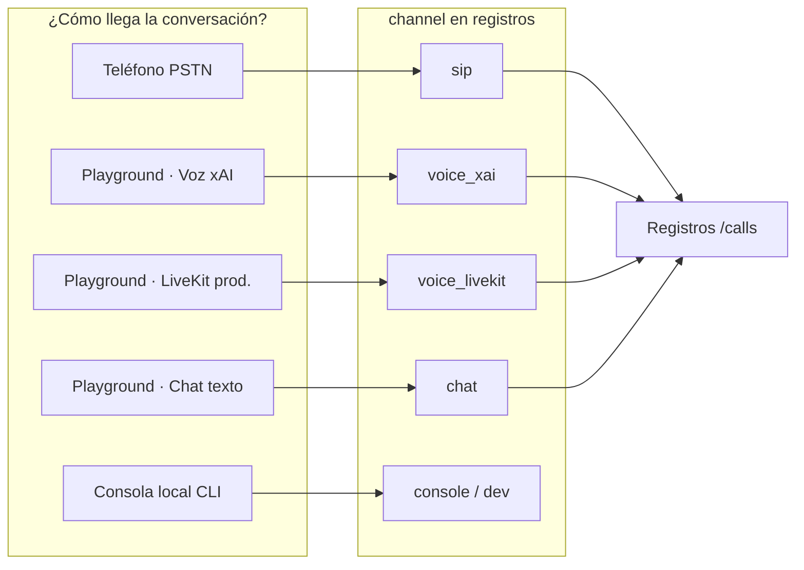
```mermaid
flowchart LR
  subgraph Entrada["¿Cómo llega la conversación?"]
    C1["Teléfono PSTN"]
    C2["Playground · Voz xAI"]
    C3["Playground · LiveKit prod."]
    C4["Playground · Chat texto"]
    C5["Consola local CLI"]
  end

  subgraph Canal["channel en registros"]
    S1["sip"]
    S2["voice_xai"]
    S3["voice_livekit"]
    S4["chat"]
    S5["console / dev"]
  end

  C1 --> S1
  C2 --> S2
  C3 --> S3
  C4 --> S4
  C5 --> S5

  S1 --> REG["Registros /calls"]
  S2 --> REG
  S3 --> REG
  S4 --> REG
```

| Canal | ¿Usa worker LiveKit? | ¿Usa DID real? | Uso típico |
|-------|----------------------|----------------|------------|
| **sip** | Sí | Sí | Producción telefónica |
| **voice_livekit** | Sí | No | Probar pipeline real desde admin |
| **voice_xai** | No | No | Probar voz Grok + tools en browser |
| **chat** | No | No | Probar handoffs y CRM en texto |

---

## 4. Llamada telefónica PSTN (completa)

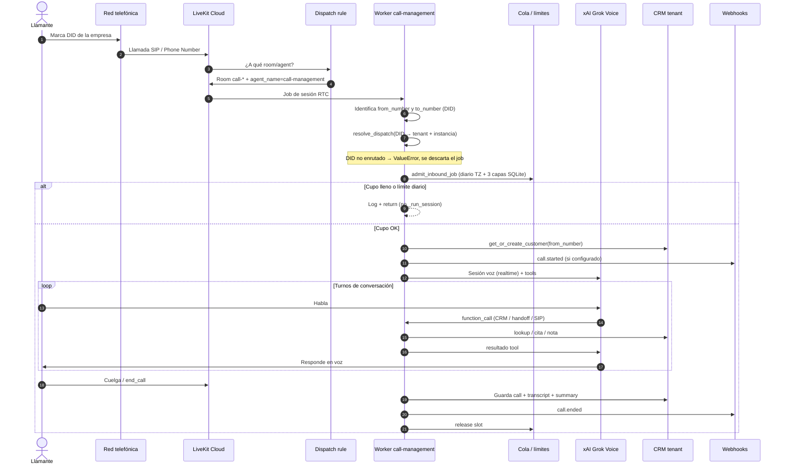
```mermaid
sequenceDiagram
  autonumber
  actor Caller as Llamante
  participant PSTN as Red telefónica
  participant LK as LiveKit Cloud
  participant DR as Dispatch rule
  participant W as Worker call-management
  participant Q as Cola / límites
  participant XAI as xAI Grok Voice
  participant CRM as CRM tenant
  participant WH as Webhooks

  Caller->>PSTN: Marca DID de la empresa
  PSTN->>LK: Llamada SIP / Phone Number
  LK->>DR: ¿A qué room/agent?
  DR->>LK: Room call-* + agent_name=call-management
  LK->>W: Job de sesión RTC
  W->>W: Identifica from_number y to_number (DID)
  W->>W: resolve_dispatch(DID → tenant + instancia)
  Note over W: DID no enrutado → ValueError, se descarta el job
  W->>Q: admit_inbound_job (diario TZ + 3 capas SQLite)
  alt Cupo lleno o límite diario
    W-->>W: Log + return (no _run_session)
  else Cupo OK
    W->>CRM: get_or_create_customer(from_number)
    W->>WH: call.started (si configurado)
    W->>XAI: Sesión voz (realtime) + tools
    loop Turnos de conversación
      Caller->>XAI: Habla
      XAI->>W: function_call (CRM / handoff / SIP)
      W->>CRM: lookup / cita / nota
      W->>XAI: resultado tool
      XAI->>Caller: Responde en voz
    end
    Caller->>LK: Cuelga / end_call
    W->>CRM: Guarda call + transcript + summary
    W->>WH: call.ended
    W->>Q: release slot
  end
```

---

## 5. Resolución DID → agente

Cuando alguien marca un número, el sistema decide **empresa** y **instancia de agente**.

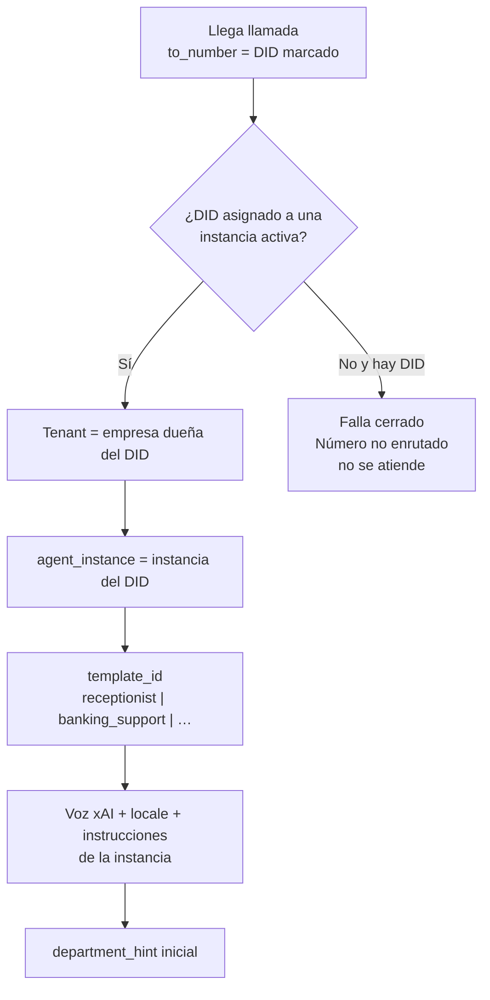
```mermaid
flowchart TD
  START["Llega llamada<br/>to_number = DID marcado"] --> DISP{"¿DID asignado a una<br/>instancia activa?"}

  DISP -->|Sí| TEN["Tenant = empresa dueña del DID"]
  DISP -->|No y hay DID| DROP["Falla cerrado<br/>Número no enrutado<br/>no se atiende"]

  TEN --> INST["agent_instance = instancia del DID"]
  INST --> TPL["template_id<br/>receptionist | banking_support | …"]
  TPL --> VOICE["Voz xAI + locale + instrucciones<br/>de la instancia"]

  VOICE --> OUT["department_hint inicial"]
```

**Regla práctica:** en **Mis agentes**, cada teléfono (DID) se enlaza a un agente. Ese es el “dueño” de la línea. Un DID desconocido no cae al receptionist global.

---

## 6. Cola y límites de concurrencia

Tres capas; **todas** deben tener cupo (si la capa está definida):

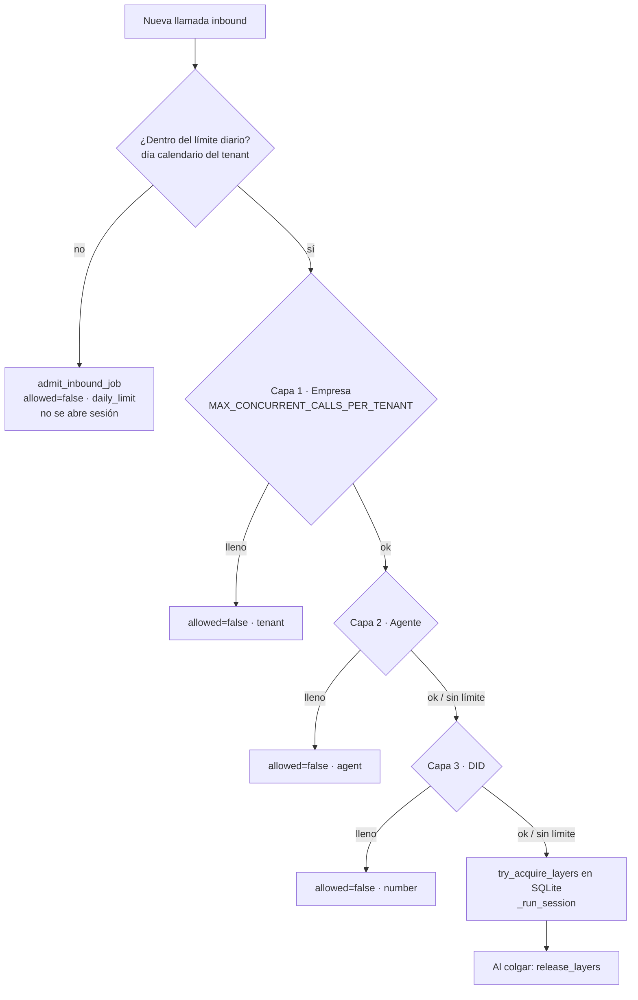
```mermaid
flowchart TD
  IN["Nueva llamada inbound"] --> DAY{"¿Dentro del límite diario?<br/>día calendario del tenant"}
  DAY -->|no| REJECT["admit_inbound_job<br/>allowed=false · daily_limit<br/>no se abre sesión"]
  DAY -->|sí| L1{"Capa 1 · Empresa<br/>MAX_CONCURRENT_CALLS_PER_TENANT"}
  L1 -->|lleno| REJECT2["allowed=false · tenant"]
  L1 -->|ok| L2{"Capa 2 · Agente"}
  L2 -->|lleno| REJECT3["allowed=false · agent"]
  L2 -->|ok / sin límite| L3{"Capa 3 · DID"}
  L3 -->|lleno| REJECT4["allowed=false · number"]
  L3 -->|ok / sin límite| OK["try_acquire_layers en SQLite<br/>_run_session"]

  OK --> END["Al colgar: release_layers"]
```

Los slots de concurrencia viven en `platform.db` (`concurrency_slots`) y se comparten entre procesos del worker. El diario usa `tenant.timezone`, no solo UTC.

---

## 7. Horario y estado del agente

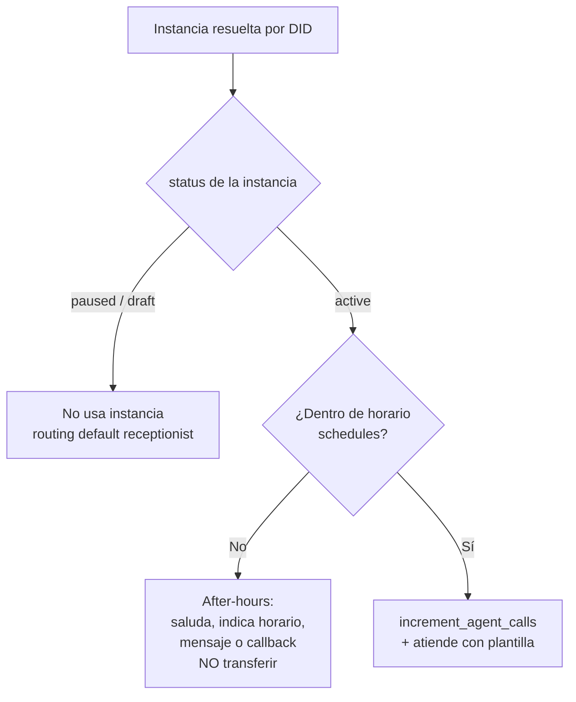
```mermaid
flowchart TD
  START["Instancia resuelta por DID"] --> ST{"status de la instancia"}
  ST -->|paused / draft| FALL["No usa instancia<br/>routing default receptionist"]
  ST -->|active| SCH{"¿Dentro de horario<br/>schedules?"}
  SCH -->|No| AH["After-hours:<br/>saluda, indica horario,<br/>mensaje o callback<br/>NO transferir"]
  SCH -->|Sí| INC["increment_agent_calls<br/>+ atiende con plantilla"]
```

---

## 8. Atención de la llamada (diálogo)

Estilo compartido (`phone_style` + Think Fast 2.0). En SIP, `GROK_VOICE_*` (idle, keyterms, replace, speed, resumption) va en el primer `session.update` del `RealtimeModel`:

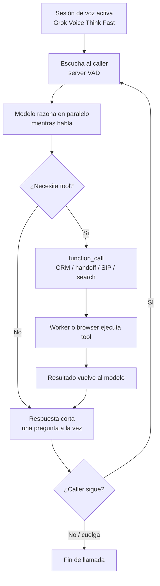
```mermaid
flowchart TD
  A["Sesión de voz activa<br/>Grok Voice Think Fast"] --> B["Escucha al caller<br/>server VAD"]
  B --> C["Modelo razona en paralelo<br/>mientras habla"]
  C --> D{"¿Necesita tool?"}
  D -->|No| E["Respuesta corta<br/>una pregunta a la vez"]
  D -->|Sí| F["function_call<br/>CRM / handoff / SIP / search"]
  F --> G["Worker o browser ejecuta tool"]
  G --> H["Resultado vuelve al modelo"]
  H --> E
  E --> I{"¿Caller sigue?"}
  I -->|Sí| B
  I -->|No / cuelga| J["Fin de llamada"]
```

**Principios de atención (todos los agentes):**

1. Escuchar primero; no interrogar al inicio.  
2. Una pregunta a la vez.  
3. No inventar identidad del caller.  
4. CRM solo con teléfono que **dice** el cliente (voz).  
5. Frases cortas en voz; confirmar solo acciones irreversibles.

---

## 9. Recepción y handoffs

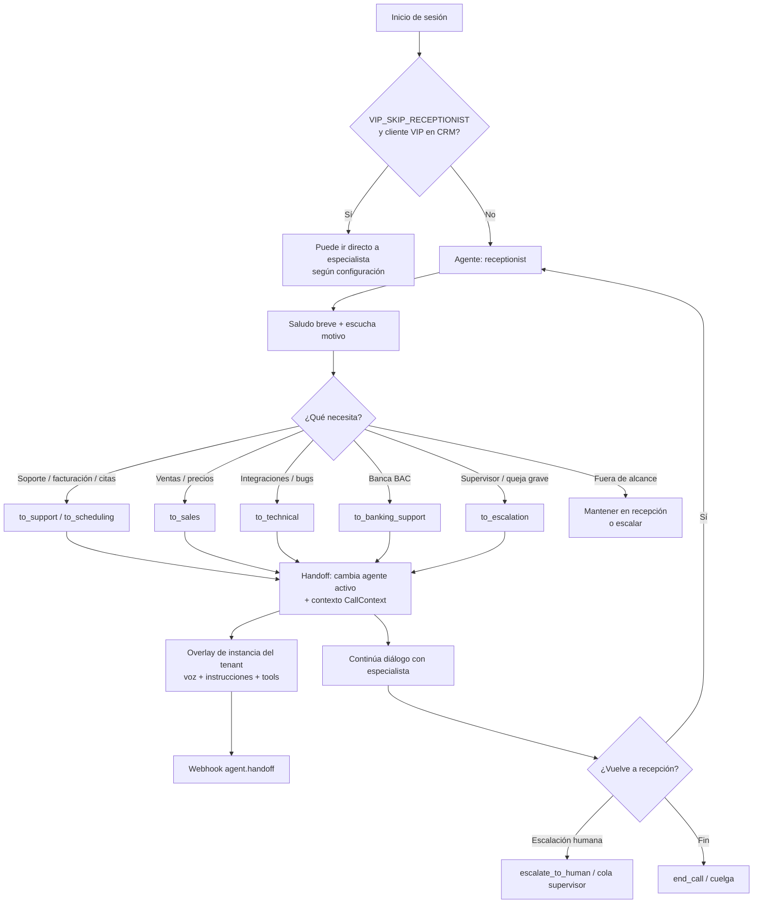
```mermaid
flowchart TD
  START["Inicio de sesión"] --> VIP{"VIP_SKIP_RECEPTIONIST<br/>y cliente VIP en CRM?"}
  VIP -->|Sí| SPEC["Puede ir directo a especialista<br/>según configuración"]
  VIP -->|No| REC["Agente: receptionist"]

  REC --> LISTEN["Saludo breve + escucha motivo"]
  LISTEN --> DEC{"¿Qué necesita?"}

  DEC -->|Soporte / facturación / citas| SUP["to_support / to_scheduling"]
  DEC -->|Ventas / precios| SALES["to_sales"]
  DEC -->|Integraciones / bugs| TECH["to_technical"]
  DEC -->|Banca BAC| BANK["to_banking_support"]
  DEC -->|Supervisor / queja grave| ESC["to_escalation"]
  DEC -->|Fuera de alcance| REC2["Mantener en recepción<br/>o escalar"]

  SUP --> H["Handoff: cambia agente activo<br/>+ contexto CallContext"]
  SALES --> H
  TECH --> H
  BANK --> H
  ESC --> H

  H --> OV["Overlay de instancia del tenant<br/>voz + instrucciones + tools"]
  OV --> WH["Webhook agent.handoff"]
  H --> CONT["Continúa diálogo con especialista"]

  CONT --> BACK{"¿Vuelve a recepción?"}
  BACK -->|Sí| REC
  BACK -->|Escalación humana| HUMAN["escalate_to_human / cola supervisor"]
  BACK -->|Fin| END["end_call / cuelga"]
```

### Mapa de handoffs (function tools)

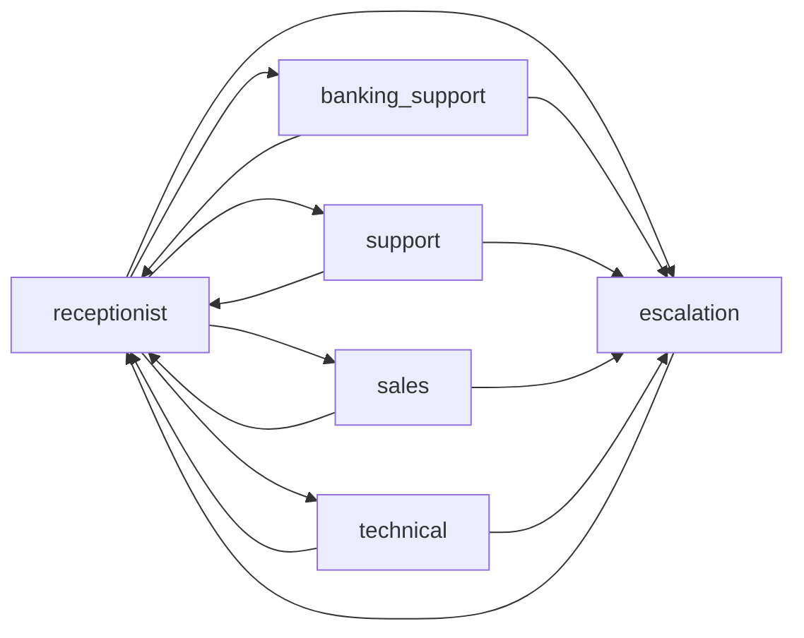
```mermaid
flowchart LR
  R[receptionist]
  S[support]
  SA[sales]
  T[technical]
  B[banking_support]
  E[escalation]

  R --> S
  R --> SA
  R --> T
  R --> B
  R --> E
  S --> R
  SA --> R
  T --> R
  B --> R
  B --> E
  S --> E
  SA --> E
  T --> E
  E --> R
```

---

## 10. Soporte bancario (BAC)

Plantilla `banking_support` (español por defecto):

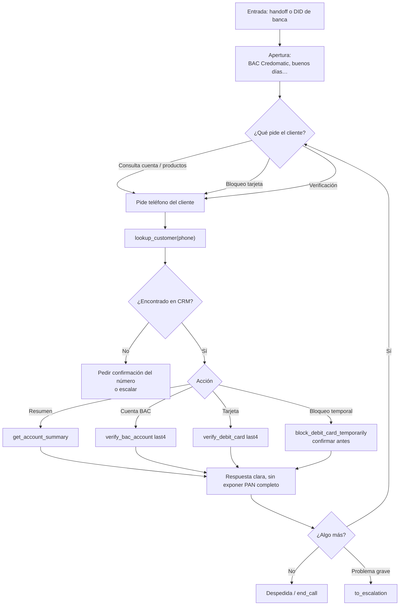
```mermaid
flowchart TD
  IN["Entrada: handoff o DID de banca"] --> OPEN["Apertura:<br/>BAC Credomatic, buenos días…"]
  OPEN --> NEED{"¿Qué pide el cliente?"}

  NEED -->|Consulta cuenta / productos| PH["Pide teléfono del cliente"]
  NEED -->|Bloqueo tarjeta| PH
  NEED -->|Verificación| PH

  PH --> LOOK["lookup_customer(phone)"]
  LOOK --> FOUND{"¿Encontrado en CRM?"}
  FOUND -->|No| RETRY["Pedir confirmación del número<br/>o escalar"]
  FOUND -->|Sí| ACT{"Acción"}

  ACT -->|Resumen| SUM["get_account_summary"]
  ACT -->|Cuenta BAC| ACC["verify_bac_account last4"]
  ACT -->|Tarjeta| CARD["verify_debit_card last4"]
  ACT -->|Bloqueo temporal| BLK["block_debit_card_temporarily<br/>confirmar antes"]

  SUM --> OUT["Respuesta clara, sin exponer PAN completo"]
  ACC --> OUT
  CARD --> OUT
  BLK --> OUT

  OUT --> MORE{"¿Algo más?"}
  MORE -->|Sí| NEED
  MORE -->|No| END["Despedida / end_call"]
  MORE -->|Problema grave| ESC["to_escalation"]
```

---

## 11. Herramientas (CRM, SIP, xAI)

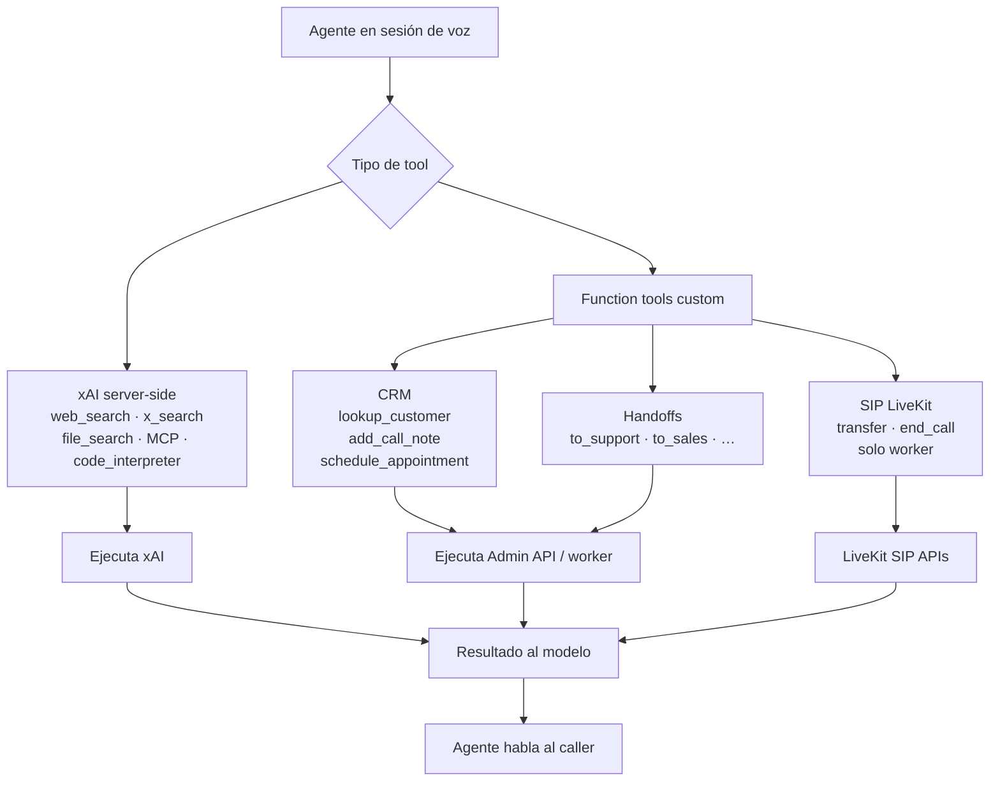
```mermaid
flowchart TB
  AG["Agente en sesión de voz"] --> DEC{"Tipo de tool"}

  DEC --> BUILTIN["xAI server-side<br/>web_search · x_search<br/>file_search · MCP · code_interpreter"]
  DEC --> FN["Function tools custom"]

  FN --> CRM["CRM<br/>lookup_customer<br/>add_call_note<br/>schedule_appointment"]
  FN --> HO["Handoffs<br/>to_support · to_sales · …"]
  FN --> SIP["SIP LiveKit<br/>transfer · end_call<br/>solo worker"]

  BUILTIN --> XAI["Ejecuta xAI"]
  CRM --> APP["Ejecuta Admin API / worker"]
  HO --> APP
  SIP --> LK["LiveKit SIP APIs"]

  XAI --> BACK["Resultado al modelo"]
  APP --> BACK
  LK --> BACK
  BACK --> SPEAK["Agente habla al caller"]
```

| Contexto | Dónde se ejecutan function tools |
|----------|----------------------------------|
| Playground **xAI** | Browser → `POST /api/voice/tools/execute` |
| Worker **LiveKit / SIP** | Dentro del proceso del worker (`server.py`) |

---

## 12. Fin de llamada y post-proceso

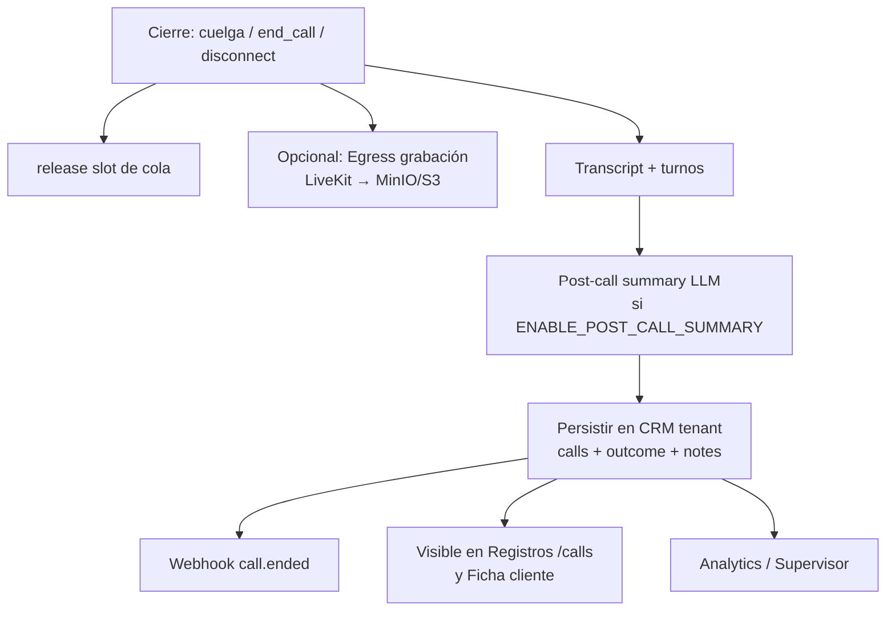
```mermaid
flowchart TD
  END["Cierre: cuelga / end_call / disconnect"] --> REL["release slot de cola"]
  END --> REC["Opcional: Egress grabación<br/>LiveKit → MinIO/S3"]
  END --> TR["Transcript + turnos"]
  TR --> SUM["Post-call summary LLM<br/>si ENABLE_POST_CALL_SUMMARY"]
  SUM --> CRM["Persistir en CRM tenant<br/>calls + outcome + notes"]
  CRM --> WH["Webhook call.ended"]
  CRM --> REG["Visible en Registros /calls<br/>y Ficha cliente"]
  CRM --> AN["Analytics / Supervisor"]
```

---

## 13. Playground voz xAI (admin)

Canal de prueba **sin** sala LiveKit (browser ↔ xAI).

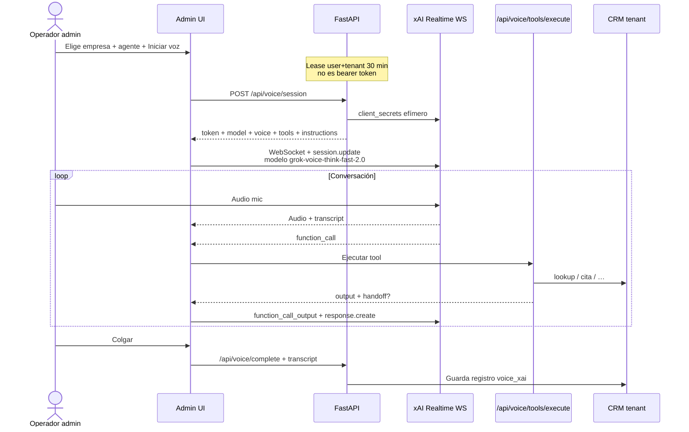
```mermaid
sequenceDiagram
  actor User as Operador admin
  participant UI as Admin UI
  participant API as FastAPI
  participant XAI as xAI Realtime WS
  participant TOOL as /api/voice/tools/execute
  participant CRM as CRM tenant

  User->>UI: Elige empresa + agente + Iniciar voz
  Note over API: Lease user+tenant 30 min<br/>no es bearer token
  UI->>API: POST /api/voice/session
  API->>XAI: client_secrets efímero
  API-->>UI: token + model + voice + tools + instructions
  UI->>XAI: WebSocket + session.update<br/>modelo grok-voice-think-fast-2.0
  loop Conversación
    User->>XAI: Audio mic
    XAI-->>UI: Audio + transcript
    XAI-->>UI: function_call
    UI->>TOOL: Ejecutar tool
    TOOL->>CRM: lookup / cita / …
    TOOL-->>UI: output + handoff?
    UI->>XAI: function_call_output + response.create
  end
  User->>UI: Colgar
  UI->>API: /api/voice/complete + transcript
  API->>CRM: Guarda registro voice_xai
```

**Preview de voz (botón Escuchar):** `POST /api/voice/preview` → TTS xAI (muestra corta MP3).

---

## 14. Playground LiveKit producción

Misma pipeline que PSTN, sin marcar por teléfono.

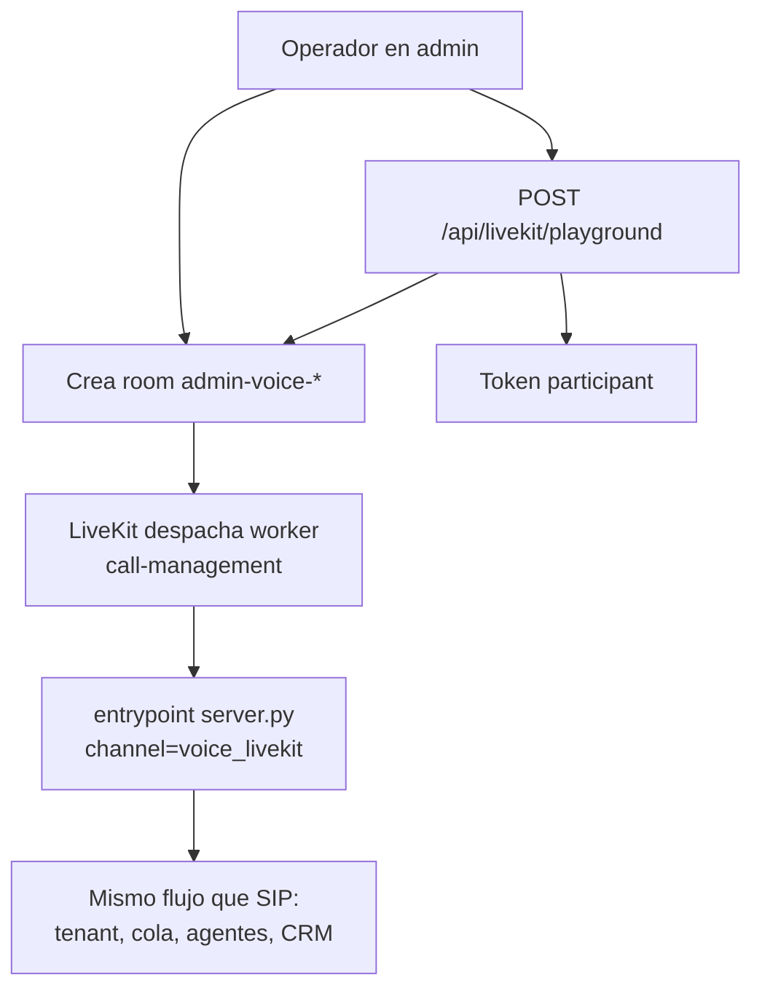
```mermaid
flowchart TD
  U["Operador en admin"] --> API["POST /api/livekit/playground"]
  API --> ROOM["Crea room admin-voice-*"]
  API --> TOKEN["Token participant"]
  ROOM --> JOB["LiveKit despacha worker<br/>call-management"]
  JOB --> EP["entrypoint server.py<br/>channel=voice_livekit"]
  EP --> SAME["Mismo flujo que SIP:<br/>tenant, cola, agentes, CRM"]
  U --> ROOM
```

---

## 15. Chat de texto multi-agente

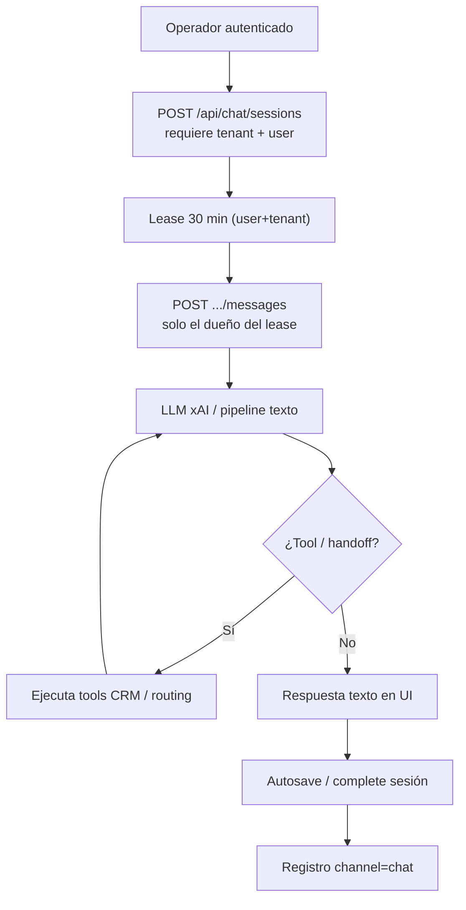
```mermaid
flowchart TD
  U["Operador autenticado"] --> S["POST /api/chat/sessions<br/>requiere tenant + user"]
  S --> LEASE["Lease 30 min (user+tenant)"]
  LEASE --> M["POST .../messages<br/>solo el dueño del lease"]
  M --> LLM["LLM xAI / pipeline texto"]
  LLM --> T{"¿Tool / handoff?"}
  T -->|Sí| EX["Ejecuta tools CRM / routing"]
  EX --> LLM
  T -->|No| R["Respuesta texto en UI"]
  R --> SAVE["Autosave / complete sesión"]
  SAVE --> CRM["Registro channel=chat"]
```

---

## 16. Alta de empresa y agente

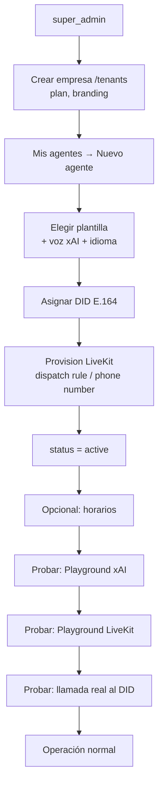
```mermaid
flowchart TD
  SA["super_admin"] --> TEN["Crear empresa /tenants<br/>plan, branding"]
  TEN --> AG["Mis agentes → Nuevo agente"]
  AG --> TPL["Elegir plantilla<br/>+ voz xAI + idioma"]
  TPL --> DID["Asignar DID E.164"]
  DID --> PROV["Provision LiveKit<br/>dispatch rule / phone number"]
  PROV --> ST["status = active"]
  ST --> SCH["Opcional: horarios"]
  SCH --> TEST1["Probar: Playground xAI"]
  TEST1 --> TEST2["Probar: Playground LiveKit"]
  TEST2 --> TEST3["Probar: llamada real al DID"]
  TEST3 --> OPS["Operación normal"]
```

### Checklist primera línea en producción

1. Worker `callmanagement-worker` **Connected** en LiveKit.  
2. `LIVEKIT_URL` = WebSocket del proyecto (no SIP subdomain).  
3. DID comprado/asignado + dispatch rule → `agent_name=call-management`.  
4. Instancia **active** con ese DID en **Mis agentes**.  
5. `XAI_API_KEY` válido y modelo `grok-voice-think-fast-2.0`.  
6. Prueba en playground LiveKit y luego llamada real.  
7. Revisar **Registros** + **Supervisor**.

---

## 17. Roles y permisos (admin)

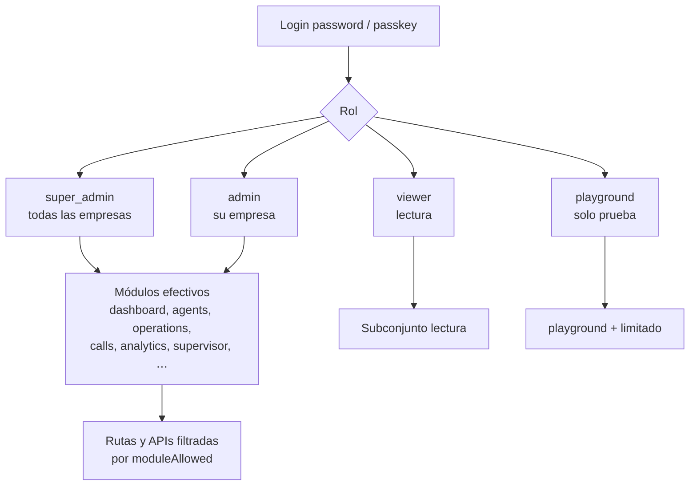
```mermaid
flowchart TD
  LOGIN["Login password / passkey"] --> ROLE{"Rol"}
  ROLE --> SA["super_admin<br/>todas las empresas"]
  ROLE --> AD["admin<br/>su empresa"]
  ROLE --> VW["viewer<br/>lectura"]
  ROLE --> PG["playground<br/>solo prueba"]

  SA --> MOD["Módulos efectivos<br/>dashboard, agents, operations,<br/>calls, analytics, supervisor, …"]
  AD --> MOD
  VW --> MOD2["Subconjunto lectura"]
  PG --> MOD3["playground + limitado"]

  MOD --> UI["Rutas y APIs filtradas<br/>por moduleAllowed"]
```

---

## 18. Servicios en el VPS

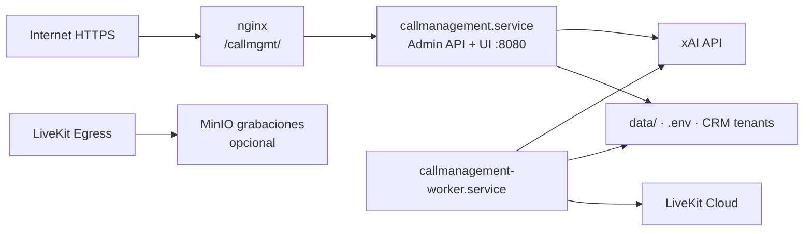
```mermaid
flowchart LR
  NET["Internet HTTPS"] --> NGX["nginx<br/>/callmgmt/"]
  NGX --> ADM["callmanagement.service<br/>Admin API + UI :8080"]
  ADM --> DATA["data/ · .env · CRM tenants"]
  WK["callmanagement-worker.service"] --> LK["LiveKit Cloud"]
  WK --> DATA
  WK --> XAI["xAI API"]
  ADM --> XAI
  EGR["LiveKit Egress"] --> MINIO["MinIO grabaciones<br/>opcional"]
```

| Unidad systemd | Función |
|----------------|---------|
| `callmanagement.service` | API + SPA admin |
| `callmanagement-worker.service` | Agentes de voz / SIP |
| `callmanagement.target` | Arranca ambos juntos |

---

## Resumen operativo “de una página”

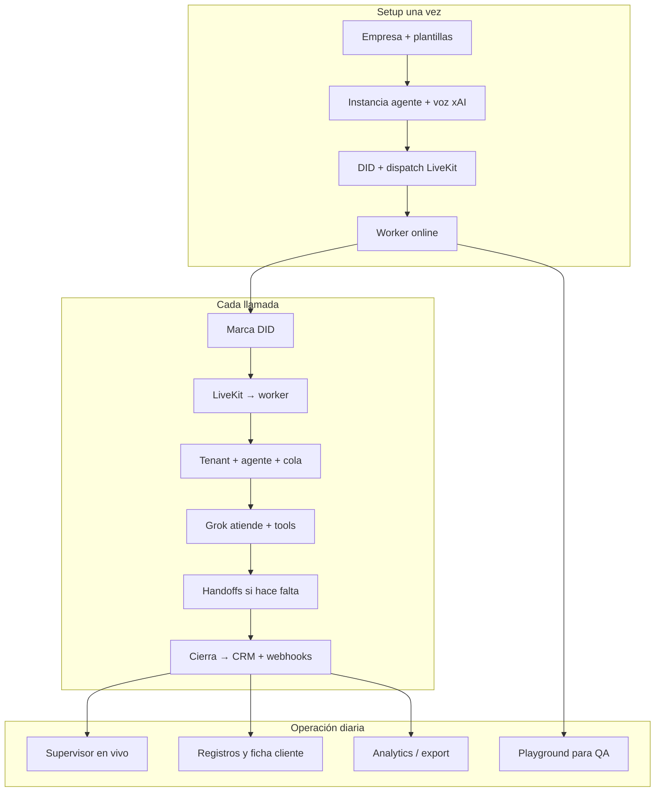
```mermaid
flowchart TB
  subgraph Setup["Setup una vez"]
    S1["Empresa + plantillas"]
    S2["Instancia agente + voz xAI"]
    S3["DID + dispatch LiveKit"]
    S4["Worker online"]
  end

  subgraph Run["Cada llamada"]
    R1["Marca DID"]
    R2["LiveKit → worker"]
    R3["Tenant + agente + cola"]
    R4["Grok atiende + tools"]
    R5["Handoffs si hace falta"]
    R6["Cierra → CRM + webhooks"]
  end

  subgraph Ops["Operación diaria"]
    O1["Supervisor en vivo"]
    O2["Registros y ficha cliente"]
    O3["Analytics / export"]
    O4["Playground para QA"]
  end

  S1 --> S2 --> S3 --> S4 --> R1
  R1 --> R2 --> R3 --> R4 --> R5 --> R6
  R6 --> O1
  R6 --> O2
  R6 --> O3
  S4 --> O4
```

---

## Glosario rápido

| Término | Definición corta |
|---------|------------------|
| **Tenant** | Empresa aislada en el orquestador |
| **Plantilla** | Tipo de agente del sistema (`receptionist`, …) |
| **Instancia** | Agente configurado de una empresa (voz, DID, horario) |
| **DID** | Número telefónico que recibe la llamada |
| **Dispatch rule** | Regla LiveKit que manda la llamada al worker |
| **Handoff** | Transferencia lógica entre agentes de IA |
| **Grok Voice** | Modelo speech-to-speech de xAI |
| **Queue slot** | Cupo de concurrencia (empresa/agente/DID) |

---

## Documentación relacionada

- [AGENTS.md](AGENTS.md) — roster, tools, banking  
- [TELEPHONY.md](TELEPHONY.md) — SIP, DID, dispatch  
- [ADMIN.md](ADMIN.md) — consola, multi-tenant, roles  
- [DEPLOYMENT.md](DEPLOYMENT.md) — VPS y systemd  
- [ANALYTICS.md](ANALYTICS.md) — reportes  

---

*Generado a partir del código y la configuración de Call Management (LiveKit + xAI + multi-tenant).*
